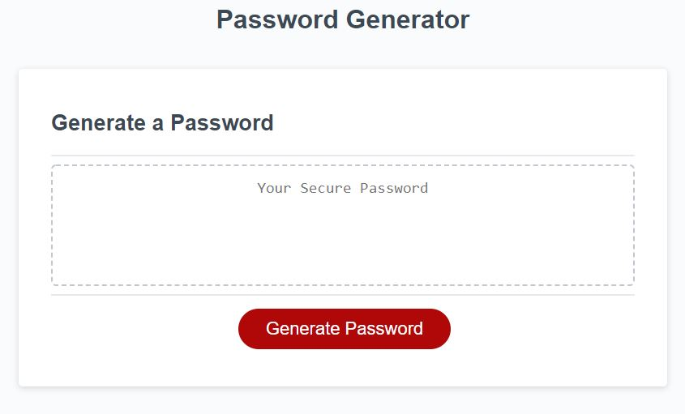

# Password Generator

### Deployed Application 

[Password Generator](https://areye022.github.io/passwordgenerator/)

### Description 
This application allows users to generate random password with specific criteria.

The password generator prompts multiple questions that allow the user to choose the criteria they want their password to meet. The generator will not allow a password that is less than 8 or greater than 128 characters. The character types that can be chosen are lowercase, uppercase, numeric, and/or special characters. When the user clicks generate password, the randomized password will be displayed on the screen.  
